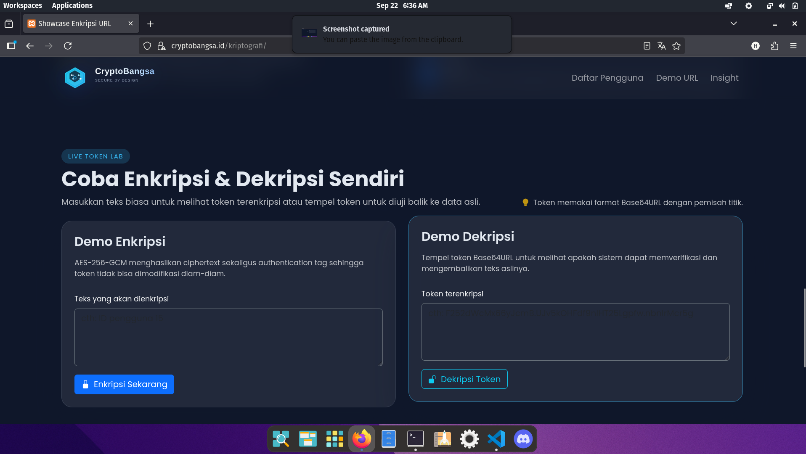
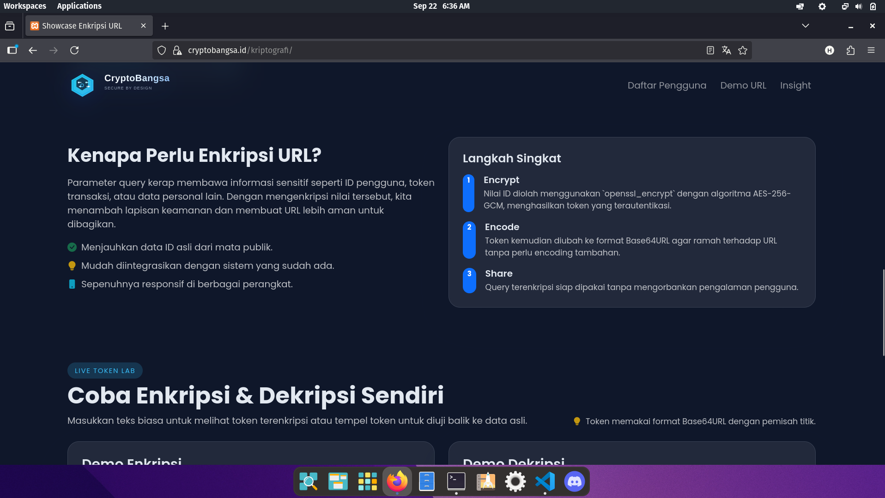

# CryptoBangsa URL Encryption Showcase


> Demo antarmuka modern untuk menampilkan cara enkripsi parameter URL menggunakan AES-256-GCM di PHP.

## Daftar Isi
- [Gambaran Umum](#gambaran-umum)
- [Fitur Unggulan](#fitur-unggulan)
- [Teknologi](#teknologi)
- [Cara Cepat Menjalankan](#cara-cepat-menjalankan)
- [Alur Enkripsi](#alur-enkripsi)
- [Highlight Demo Interaktif](#highlight-demo-interaktif)
- [Struktur Proyek](#struktur-proyek)
- [Cuplikan Layar](#cuplikan-layar)
- [Kustomisasi](#kustomisasi)
- [Tips Keamanan](#tips-keamanan)
- [Lisensi](#lisensi)
- [Tim & Kredit](#tim--kredit)

## Gambaran Umum
CryptoBangsa menampilkan bagaimana ID sensitif dapat disembunyikan di balik token terenkripsi sebelum dibagikan melalui URL. Halaman beranda menyorot daftar pengguna fiktif dengan kartu bergaya glassmorphism, dilengkapi tombol perbandingan URL polos vs URL terenkripsi, serta laboratorium mini untuk menguji enkripsi dan dekripsi.

## Fitur Unggulan
- Enkripsi simetris menggunakan `openssl_encrypt` dengan mode AES-256-GCM.
- Payload token berformat JSON berisi `issued_at`, `expires_at`, alias AAD, dan metadata konteks.
- Auto-expired token: TTL default 5 menit dengan countdown langsung pada halaman detail.
- Additional Authenticated Data (AAD) mengikat token ke rute tertentu (`detail.php`).
- Encoding Base64URL agar token aman dibawa sebagai parameter query string.
- UI futuristik berbasis Bootstrap 5 dengan animasi halus dan glass card.
- Token Journey Visualizer yang menampilkan langkah plain → payload → IV/tag/cipher → token.
- Audit Dashboard Panel mencatat jumlah valid/invalid token sepanjang sesi.
- Live Tamper Detector untuk mensimulasikan token yang dimodifikasi dan melihat penolakan GCM.
- QR share & clipboard helper untuk membagikan token terenkripsi dengan aman.
- Form demo untuk mencoba enkripsi dan dekripsi secara langsung dengan metadata hasil.
- Halaman detail yang memverifikasi token sebelum menampilkan data asli pengguna.

## Teknologi
- PHP 8 dengan ekstensi OpenSSL aktif.
- Bootstrap 5.3 dan Bootstrap Icons dari CDN.
- Font Poppins (Google Fonts) untuk tipografi modern.
- SVG logo kustom pada direktori `assets/`.

## Cara Cepat Menjalankan
1. Pastikan PHP 8+ dan ekstensi OpenSSL tersedia (XAMPP/LAMPP sudah memuatnya secara default).
2. Kloning atau salin folder ke direktori web server, contoh `htdocs/kriptografi`.
3. Buka browser dan akses `http://localhost/kriptografi/index.php`.
4. Klik salah satu kartu pengguna untuk melihat detail menggunakan token terenkripsi.

> Catatan: ganti `localhost` dan jalur sesuai konfigurasi server Anda.

## Alur Enkripsi
```
ID pengguna --> encrypt_data() --> AES-256-GCM + tag autentikasi --> Base64URL token
     ^                                                         |
     |                                                         v
 detail.php <-------------- decrypt_data() <-------------- token dari URL
```
- Token hasil enkripsi dibagi menjadi tiga bagian (IV, tag, ciphertext) dan digabung dengan pemisah titik.
- Halaman detail melakukan `decrypt_data()` dan mencocokkan ID dengan daftar pengguna.
- Token yang tidak sah akan diarahkan ke tampilan error dengan ajakan mengulang enkripsi.
- Payload JSON juga menyimpan `issued_at`, `expires_at`, alias AAD, serta konteks rute yang digunakan.
- Token kedaluwarsa otomatis ditolak dan countdown di halaman detail menampilkan sisa waktu.

## Highlight Demo Interaktif
- **Token Journey Visualizer** di beranda menampilkan setiap tahap transformasi ID hingga menjadi token siap pakai.
- **Audit Dashboard Panel** menghitung valid/invalid token selama sesi—berguna saat presentasi live.
- **Countdown & TTL** pada detail menyorot konsep masa berlaku token dan bagaimana sistem menolaknya setelah waktu habis.
- **Live Tamper Detector** memodifikasi token satu byte lewat satu klik dan memperlihatkan kegagalan autentikasi GCM.
- **Share Tools** menyediakan tombol salin token/URL dan generator QR sehingga peserta demo dapat memindai tautan terenkripsi.
- **Metadata Insight** di form demo menampilkan alias AAD dan sisa TTL saat Anda mendekripsi token secara manual.

## Struktur Proyek
```
.
assets/
  cryptobangsa-logo.svg
index.php
detail.php
encryption.php
```

## Cuplikan Layar






## Kustomisasi
- Ubah kunci enkripsi AES di `encryption.php` melalui konstanta `ENCRYPTION_KEY` (gunakan 32 byte random).
- Tambahkan data pengguna baru dengan mengedit array `$users` di `index.php` dan `detail.php` secara paralel.
- Sesuaikan gaya dengan mengganti variabel CSS dan komponen Bootstrap di masing-masing file.

## Tips Keamanan
- Simpan kunci enkripsi di luar version control (misal environment variable) untuk produksi.
- Terapkan rotasi kunci berkala dan logging yang aman ketika token diverifikasi (audit panel demo bisa diadaptasi untuk produksi).
- Gunakan Additional Authenticated Data untuk mengikat token ke rute/aplikasi tertentu.
- Atur masa berlaku token (TTL) yang realistis dan pantau countdown untuk menguji perilaku kedaluwarsa.
- Gunakan HTTPS agar token tidak bocor saat transmisi.
- Validasi semua input sebelum diproses dan tangani token rusak/diubah sebagai percobaan intrusi.

## Lisensi
Proyek ini dirilis dengan [Lisensi MIT](LICENSE), bebas digunakan, dimodifikasi, dan didistribusikan selama mencantumkan atribusi yang sesuai.

## Tim & Kredit
- Desain dan copy dummy oleh tim fiktif CryptoBangsa (Linbergh, Skyu, Xzero, Soap, Kyra).
- Terinspirasi dari praktik terbaik enkripsi URL dan pengalaman UI modern.

Selamat bereksperimen dan kembangkan fitur keamanan Anda bersama CryptoBangsa!
